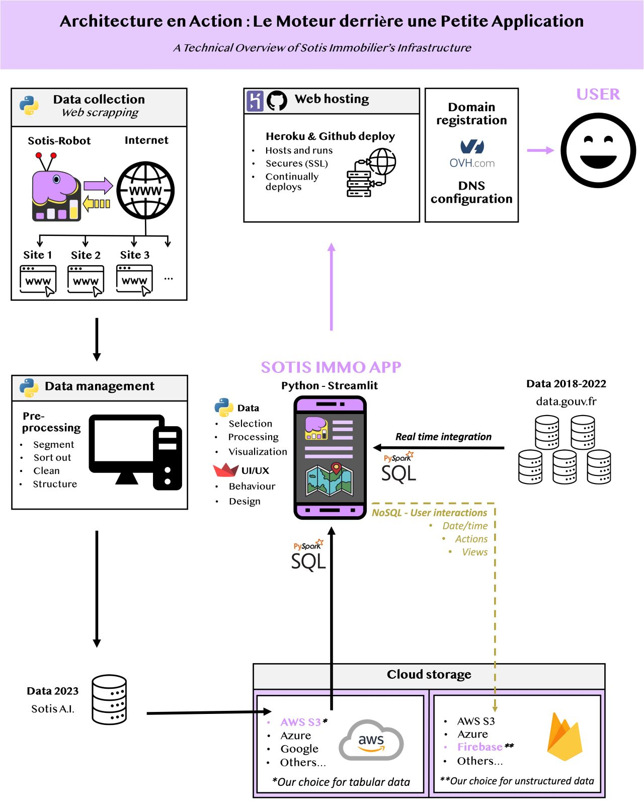
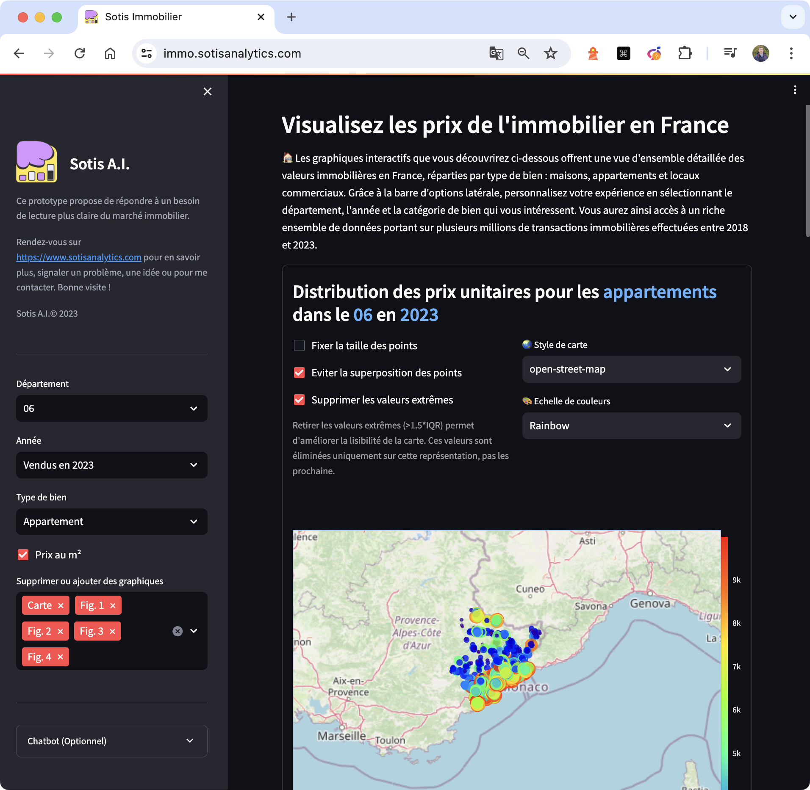

# Interactive Analysis of the French Real Estate Park Over Time

## 📄 Description

⚙️ This tool was designed for scraping and processing real estate data in order to provide very recent updates to the Sotis Immo Web App. It offers functionality to extract data from various online sources, clean and normalize the data, and store it in a SQL database.

👉 Access the app and start your exploration now at [https://immo.sotisanalytics.com](https://immo.sotisanalytics.com).

|  |  |
|:---------------------:|:---------------------:|
|Pipeline|Application|

## Prerequisites
- Anaconda or Miniconda
- Docker (for Docker deployment)

## ⚒️ Installation

### Prerequisites
- Python 3.11
- Python libraries
    ```sh
    pip install -r requirements.txt
    ```

## 📝 Usage

### Running without Docker

1. **Clone the repository and navigate to directory**
    ```bash
    git pull https://github.com/LudovicGardy/app_sotisimmo
    cd sotisimmo_repos/app_folder
    ```

2. **Environment setup**
    - Create and/or activate the virtual environment:
        ```bash
        conda create -n myenv python=3.11
        conda activate myenv
        ```
        or
        ```bash
        source .venv/bin/activate
        ```

3. **Start the ETL Process**
    - Run the Python script:
        ```bash
        python main.py
        ```

4. **Configuration**
    - Using `modules/config.py`, configure the scraping parameters:
        - Year (e.g., `2023`)
        - [Optional] Department (default: `1`)

    - Example: Selecting `2023` and `1` will iterate over all departments (from 1 to 914) for the year 2023.

5. **Process**
    - Iterates over each department (1 to 95) from `onset_date` to `offset_date`.
    - Fetches and parses online data for offers.
    - Cleans, normalizes, and stores data in the SQL database.

### Running with Docker

1. **Prepare Docker environment**
    - Ensure Docker is installed and running on your system.

2. **Navigate to project directory**
    - For multiple containers:
        ```bash
        cd [path-to-app-folder-containing-docker-compose.yml]
        ```
    - For a single container:
        ```bash
        cd [path-to-app-folder-containing-Dockerfile]
        ```

3. **Build and start the containers**
    ```bash
    docker-compose up --build
    ```

    - The application will be accessible at `localhost:8501`.

    - ⚠️ If you encounter issues with `pymssql`, adjust its version in `requirements.txt` or remove it before building the Docker image.

## 👤 Author
- LinkedIn: [Ludovic Gardy](https://www.linkedin.com/in/ludovic-gardy/)
- Website: [https://www.sotisanalytics.com](https://www.sotisanalytics.com)